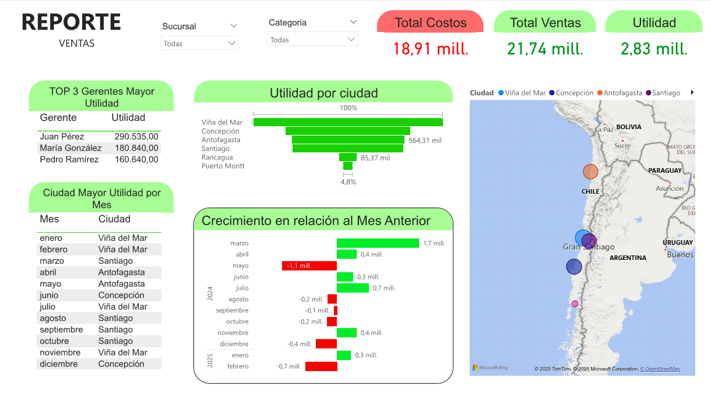
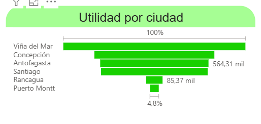
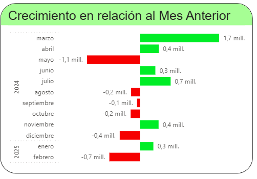

# ⚙️ Pipeline de Datos Automatizado: Dashboard de Ventas y Utilidades

> **Arquitectura de datos end-to-end para el monitoreo comercial:** Ingesta y ETL automatizado con Python, almacenamiento relacional optimizado en MySQL y visualización ejecutiva en Power BI para el control de rentabilidad multisucursal.


---

## 📌 Navegación Rápida
[← Volver al Portafolio Principal](https://camiloalarcon25.github.io/Mi_Portafolio_v1/)

- [Vista General del Dashboard](#-vista-general-del-dashboard)
- [El Desafío de Negocio](#-el-desafío-de-negocio)
- [Arquitectura de Datos y Metodología](#arquitectura)
- [Insights y Hallazgos Clave](#-insights-y-hallazgos-clave)
- [Vistas Detalladas](#vistas)
- [Recomendaciones de Gestión](#-recomendaciones-de-gestión)
- [Recursos del Repositorio](#-recursos-del-repositorio)

---

## 📸 Vista General del Dashboard

> *El cuadro de mando consolida los ingresos, costos y márgenes de utilidad en tiempo real, ofreciendo una visión integral del rendimiento operacional por sucursal y categoría de producto.*



---

## 🎯 El Desafío de Negocio

La gestión comercial de una empresa multisucursal suele enfrentar inconsistencias debido al manejo fragmentado de reportes en planillas independientes. Esto genera retrasos en la consolidación de información y riesgos de duplicidad de datos.

El objetivo de este proyecto fue **diseñar e implementar un flujo de datos automatizado y escalable**, resolviendo preguntas clave del negocio:
1. **¿Cuál es la rentabilidad neta real por sucursal tras descontar la estructura de costos operativos?**
2. **¿Cómo eliminar la duplicidad y errores humanos en la ingesta periódica de transacciones?**
3. **¿Cuáles son los Top 5 productos más vendidos y las sucursales con mejor margen comercial?**

---

## <a name="arquitectura"></a>🛠️ Arquitectura de Datos y Metodología

El proyecto implementa un pipeline de datos robusto articulado en tres capas tecnológicas:

```text
[ Archivos CSV / Ingesta ] ──( Python ETL Script )──> [ Base de Datos MySQL ] ──( DirectQuery / Modelado )──> [ Dashboard Power BI ]
```

### 1. Ingesta y Script ETL Automatizado (Python & Pandas)

* **Origen:** Archivos planos de transacciones en formato CSV.
* **Procesamiento:** Script en Python (`insertar_nuevos_datos.py`) con Pandas para la limpieza de datos y conexión a la base de datos MySQL.
* **Manejo de Duplicados:** Implementación de la lógica `ON DUPLICATE KEY UPDATE` en SQL/Python para garantizar que el script pueda ejecutarse de forma recurrente sin generar registros repetidos.

### 2. Almacenamiento y Auditoría de Datos (MySQL)

* **Esquema Relacional:** Modelo optimizado (`ventas_costos.sql`) con tablas de `Sucursales`, `Productos`, `Ventas` y `Costos`, vinculadas mediante llaves primarias y foráneas (1:N).
* **Consultas de Validación:** Scripts de auditoría (`revision_datos.sql`) para precalculos de márgenes e integridad referencial antes de la capa de BI.

### 3. Modelado y Visualización (Power BI)

* **Conexión Directa:** Vinculación con la base de datos MySQL para actualización dinámica de métricas.
* **Métricas DAX Calculadas:**
  * **Ingresos Totales:** `SUM(Ventas[Monto_Total])`
  * **Costos Totales:** `SUM(Costos[Monto_Costo])`
  * **Utilidad Neta:** `[Ingresos Totales] - [Costos Totales]`
  * **Margen de Utilidad (%):** `DIVIDE([Utilidad Neta], [Ingresos Totales], 0)`

---

## 📈 Insights y Hallazgos Clave

| Métrica / Dimensión | Resultado Observado | Impacto en el Negocio |
| :--- | :--- | :--- |
| **Ingresos Totales** | `$XX.XXX.XXX` | Consolidación unificada de todas las sucursales |
| **Margen de Utilidad Global** | `XX,X%` | Visibilidad real del margen tras deducción de costos |
| **Procesamiento ETL** | `Automático` | Eliminación de cargas manuales en planillas |
| **Integridad de Datos** | `100% Sin Duplicados` | Garantizada por restricciones de llaves en MySQL |

### 💡 Principales Conclusiones

* **Optimización Operativa:** La automatización de la ingesta de datos reduce significativamente los tiempos de preparación de reportes frente a procesos manuales.
* **Centralización Única de la Verdad:** El almacenamiento en MySQL elimina las discrepancias típicas de archivos Excel dispersos entre gerentes regionales.
* **Escalabilidad Garantizada:** La estructura de base de datos relacional y el script idempotente en Python preparan a la organización para procesar grandes volúmenes de transacciones sin pérdida de rendimiento.

---

## <a name="vistas"></a>🖼️ Vistas Detalladas del Dashboard

<table width="100%">
  <tr>
    <td width="50%" align="center">
      <b>Análisis de Utilidad por Ciudad</b><br><br>
      
    </td>
    <td width="50%" align="center">
      <b>Crecimiento en relación al mes anterior</b><br><br>
      
    </td>
  </tr>
</table>

---

## 💡 Recomendaciones de Gestión

1. **Programación de Ejecución ETL (Cron Jobs):** Automatizar el script de Python mediante tareas programadas (Schedule/Cron) para realizar cargas nocturnas periódicas.
2. **Reasignación de Inventario por Rendimiento:** Utilizar el Ranking Top 5 para redistribuir stock hacia las sucursales con mayor rotación y mejor margen de utilidad.
3. **Monitoreo de Filiales en Zona Crítica:** Auditar las sucursales que presenten un margen de utilidad inferior a la media global para aplicar ajustes en su estructura de costos.

---

## 📂 Recursos del Repositorio

* 📄 **Reporte Ejecutivo (PDF):** [Proyecto_BI.pdf](https://github.com/CamiloAlarcon25/Pipeline-de-datos-Automatizado/blob/main/Proyecto_BI.pdf)
* 🐍 **Script Pipeline ETL (Python):** [Ver archivo .py](https://github.com/CamiloAlarcon25/Pipeline-de-datos-Automatizado/blob/main/insertar_nuevos_datos.py)
* 🗄️ **Modelo y Consultas (MySQL):** [Ver script .sql](https://github.com/CamiloAlarcon25/Pipeline-de-datos-Automatizado/blob/main/ventas_costos.sql)
* 📊 **Dashboard Interactivo (Power BI):** [Descargar archivo .pbix](https://github.com/CamiloAlarcon25/Pipeline-de-datos-Automatizado/blob/main/Proyecto_BI.pbix)
